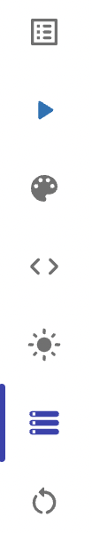

## Summary

In this assignment you will be querying data from a database.

The _Programs_ database stores data for different applications. The structure and contents of the _Programs_ database is shown below. You will use this database to answer the Tasks in this assignment.

## Database Schema

The schema for the _Programs_ database is shown below and should be used to answer the next several problems. You can reference these images during the exercise but keep in mind they are not exhaustive in the data they display.

The `calendar` table

## Instructions

Given the structure of the _Programs_ database shown above, use SQL commands to answer the problems in the following steps.

Write your SQL statement in the editor on the left, then click the **Run Code** button to execute your statement in the interactive MySQL shell.

## Getting Started

To get started, first select a database. On the right side of the Companion, there is an option "select database", select this option.

It will open a drop down list of available databases. Select the option listed in the instructions.

