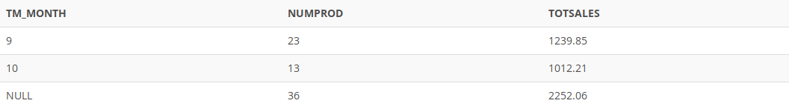

## Problem 9

What is the SQL command to list the number of product sales (number of rows) and total sales by month, with subtotals by month and a grand total for all sales? _Figure P13.9_ shows the result of the query.

Figure P13.9

