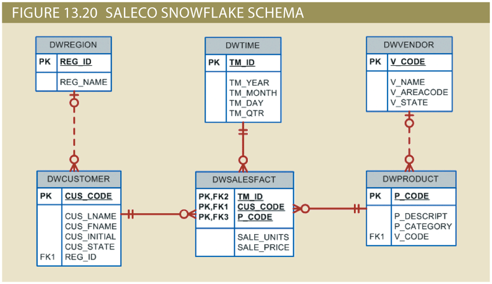

## Instructions

Using the data provided in the *Ch13_SaleCo* database, solve problems 5 - 11. 

>*Hint*: In *Problems 5–11*, use the `ROLLUP` command.

## Database Schema

## Instructions
Given the structure of the *Ch13_SaleCo* database shown above, use SQL commands to answer the problems in the following steps.

Write your SQL statement in the editor on the right, then click the **Run** button to execute your statement in the interactive MySQL shell.

Click **Next Step** to get started!