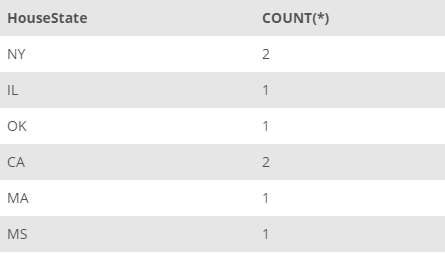
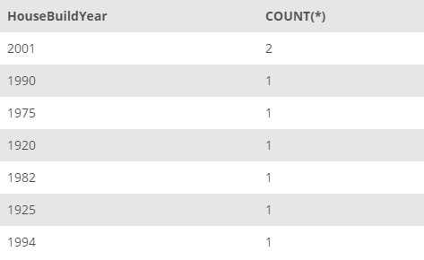
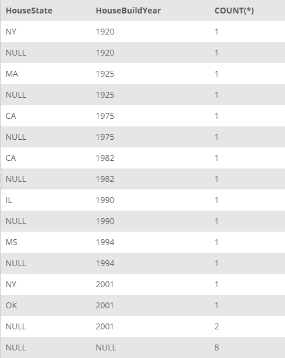

## Task 1:##
The House Development team wants to run the internal survey on the properties registered in InstantStay for which the team requires the state location and build year detail for each house. You need to provide these information as separate tables:

- Number of houses by build year
- Number of houses by state

You need to run the following queries to get the data:

```mysql
SELECT
    HouseState, COUNT(*)
FROM
    HOUSE
GROUP BY HouseState;
```

```mysql
SELECT
    HouseBuildYear, COUNT(*)
FROM
    HOUSE
GROUP BY HouseBuildYear;
```

You can send the following two tables to the House Development team:

| Number of Houses by State                                                           | Number of Houses by Build Year                                                           |
| ----------------------------------------------------------------------------------- | ---------------------------------------------------------------------------------------- |
| <p align='center'>

</p> | <p align='center'>

</p> |

<sup>_Number of houses by state and build year_</sup>

In addition, the team wants to see the number of houses by state and build year in a single summary table. You need to use `ROLLUP` functionality of MySQL as follows:

```mysql
SELECT
    HouseState, HouseBuildYear, COUNT(*)
FROM
    HOUSE
GROUP BY HouseBuildYear, HouseState WITH ROLLUP;
```

You can send the following data as a summary table:

<p align='center'>

</p>

<sup>_Number of houses by state and build year in a single summary table_</sup>

> The `ROLLUP` statement sets a `NULL` value for the total rows. For instance, in the second row with `NULL, 1920, 1` indicates that there are total of 1 houses with `HouseBuildYear` value of `1920`.
