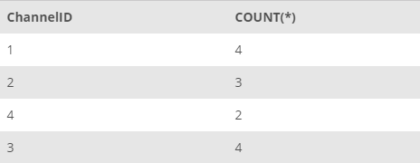
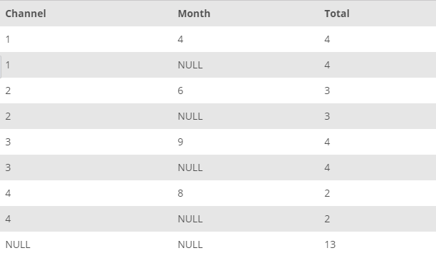

## Task 2:##
The Channel Development team wants to analyze the usage of channels which are currently associated in getting more business to the system. The primary requirement for the team is the number of reservations made for stays at InstantStay houses through each channel. You can get the required data with the following command:

```mysql
SELECT
    ChannelID, COUNT(*)
FROM
    STAY
GROUP BY ChannelID;
```

This statement returns the sum of stays reservations made through each channel as follows:

<p align='center'>

</p>

<sup>_Stays with channels_</sup>

However, the team also wants to know for which months were these channels active. In addition, the team has requested the details like the channel name and the total number of reservations made through that channel. You need to send the number of stays made in each month through each channel with the help of following query:

```mysql
SELECT
    ChannelID AS Channel,
    MONTH(StayStartDate) AS Month,
    COUNT(*) AS Total
FROM
    STAY
GROUP BY ChannelID , MONTH(StayStartDate) WITH ROLLUP;
```

This statement will collect the data with the new column names as shown in the following table:

<p align='center'>

</p>

<sup>_Stays with channels and months_</sup>
