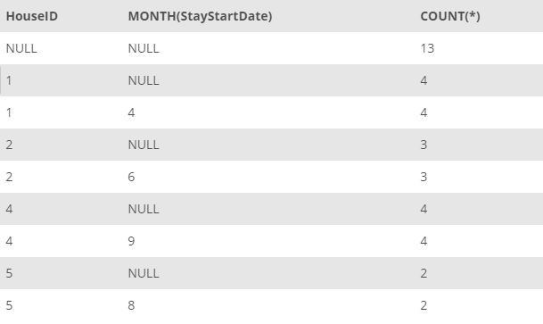

## Task 3:##
The House Development team wants to group the houses in InstantStay for their usage. For that reason, they want to get the data for number of stays for each house for each month. The team also require the data to be ordered by **HouseID** and the month##

You can retrieve the requested data with the following query:

```mysql
SELECT
    HouseID, MONTH(StayStartDate), COUNT(*)
FROM
    STAY
GROUP BY HouseID, MONTH(StayStartDate) WITH ROLLUP
ORDER BY HouseID, MONTH(StayStartDate);
```

This statement will return the total number of stays with `HouseID` and the month in order:

<p align='center'>

</p>

<sup>_Stays with house and month_</sup>
