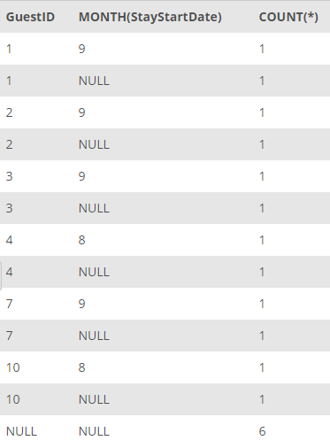

## Task 4:##
The Marketing team conducted personalized advertising for the guests in the second half of the year. Thus, they want to analyze the number of stays for each guest in each month in the second half of the year.

You can get the requested data with the following query:

```mysql
SELECT
    GuestID, MONTH(StayStartDate), COUNT(*)
FROM
    STAY
WHERE
    MONTH(StayStartDate ) > 6
GROUP BY GuestID, MONTH(StayStartDate) WITH ROLLUP;
```

Since we have filtered by the month larger than 6, the data will return for the second half of the year as follows:

<p align='center'>

</p>

<sup>_Guests and their stays in each month_</sup>
