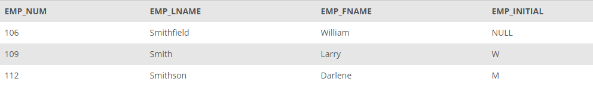

## Problem 1
Write the SQL code required to list the employee number, last name, first name, and middle initial of all employees whose last names start with Smith. In other words, the rows for both Smith and Smithfield should be included in the listing. Sort the results by employee number. Assume case sensitivity.  Display the attributes shown in the results presented in *Figure P7.1*.

Figure P7.1

