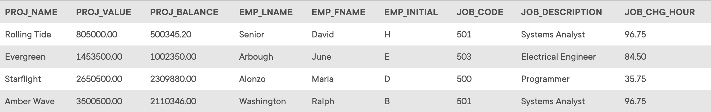

## Problem 2
Using the `EMPLOYEE`, `JOB`, and `PROJECT` tables in the *Ch07_ConstructCo* database, write the SQL code that will join the `JOB`, `EMPLOYEE`, and `PROJECT` tables using common attributes. Display the attributes shown in the results presented in *Figure P7.2*, sorted by project value.

Figure P7.2

