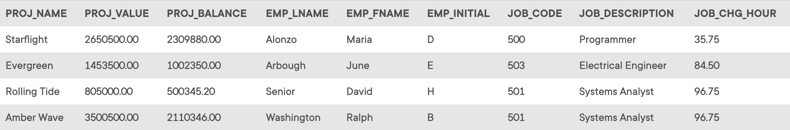

## Problem 3
Write the SQL code that will produce the same information that was shown in *Problem 2*, but sorted by the employee’s last name. The results of running that query are shown in *Figure P7.3*.

Figure P7.3
