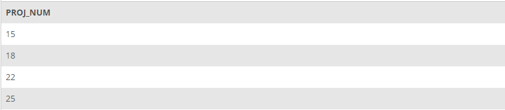

## Problem 4
Write the SQL code that will list only the distinct project numbers in the `ASSIGNMENT` table, sorted by project number. The results of running that query are shown in *Figure P7.4*.

Figure P7.4
