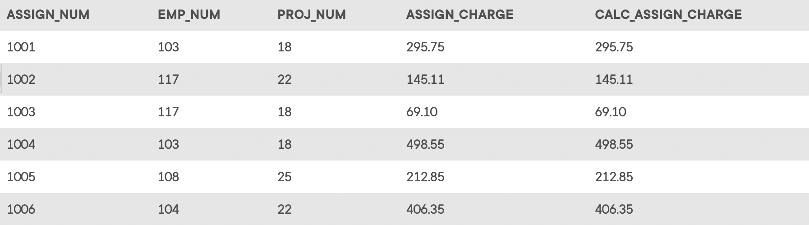

## Problem 5
Write the SQL code to validate the `ASSIGN_CHARGE` values in the `ASSIGNMENT` table. Your query should retrieve the assignment number, employee number, project number, the stored assignment charge (`ASSIGN_CHARGE`), and the calculated assignment charge (`CALC_ASSIGN_CHARGE`, calculated by multiplying `ASSIGN_CHG_HR` by `ASSIGN_HOURS` and rounded to two decimal places). Sort the results by the assignment number. The results of running that query are shown in *Figure P7.5*.

Figure P7.5

