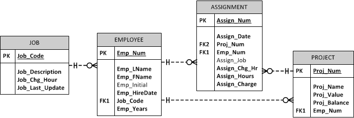
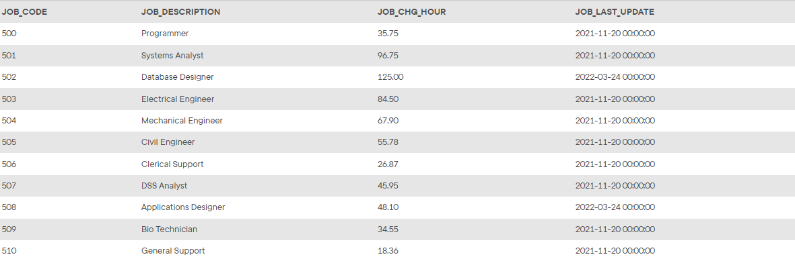
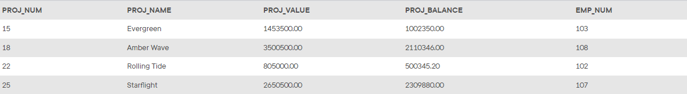
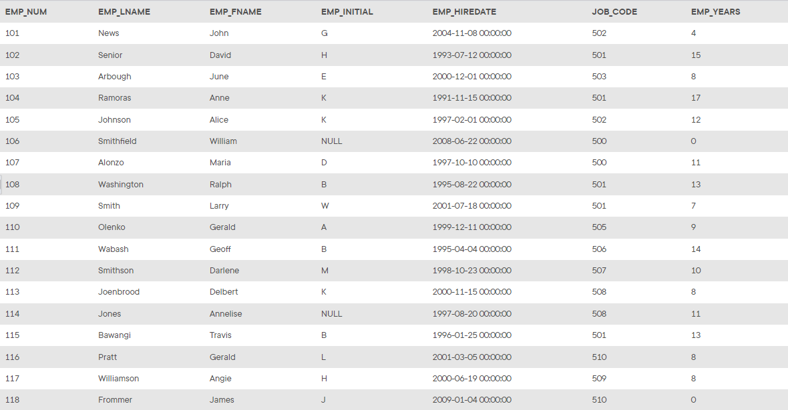
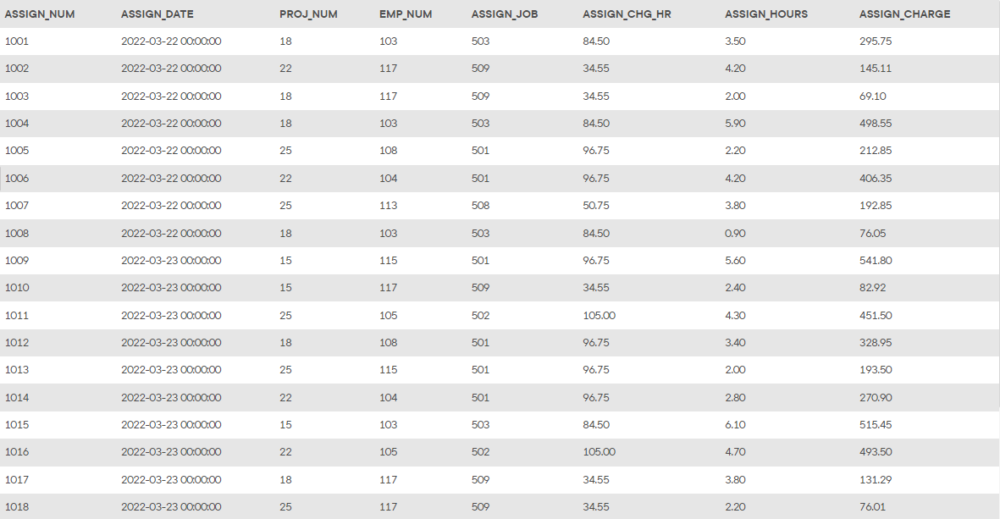

## Summary

The *Ch07_ConstructCo* database stores data for a consulting company that tracks all charges to projects. The charges are based on the hours each employee works on each project. The structure and contents of the *Ch07_ConstructCo* database are shown in the tables below.

## Database Schema

Click on the image to open it in a new tab for better readability.

> The images below may not include all the data in the corresponding table.

_The `JOB` table_

_The `PROJECT` table_

_The `EMPLOYEE` table_

_The `ASSIGNMENT` table_

> Note that the `ASSIGNMENT` table stores the `JOB_CHG_HOUR` values as an attribute (`ASSIGN_CHG_HR`) to maintain historical accuracy of the data. The `JOB_CHG_HOUR` values are likely to change over time. In fact, a `JOB_CHG_HOUR` change will be reflected in the `ASSIGNMENT` table. Naturally, the employee primary job assignment might also change, so the `ASSIGN_JOB` is also stored. Because those attributes are required to maintain the historical accuracy of the data, they are not redundant.

## Instructions

Given the structure of the *Ch07_ConstructCo* database shown above, use SQL commands to answer the problems in the following steps.

Write your SQL statement in the editor below each question, then click the **Run** button to execute your statement in the interactive MySQL shell.

Click **Next Step** to get started!
