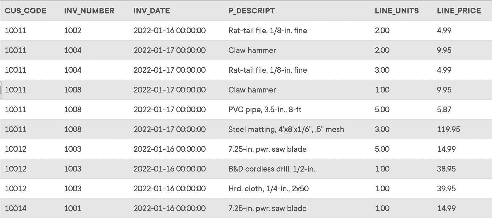

## Problem 11

Generate a listing of all purchases made by the customers, using the output shown in *Figure P7.11* as your guide. Sort the results by customer code, invoice number, and product description.

Figure P7.11
