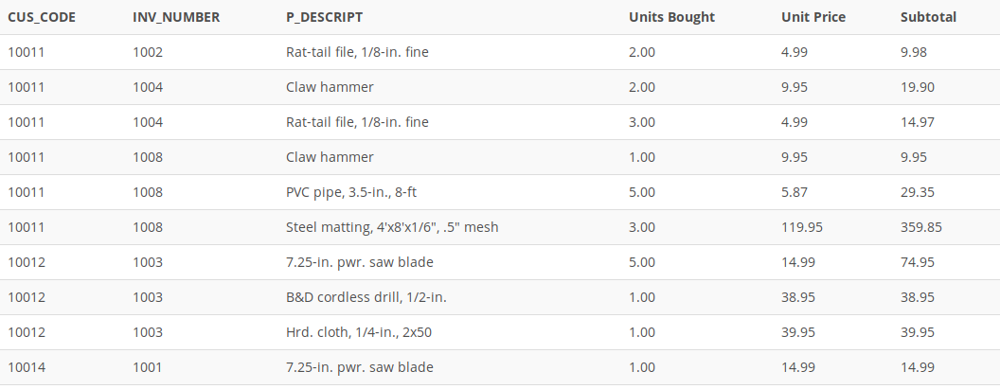

## Problem 12

Using the output shown in *Figure P7.12* as your guide, generate a list of customer purchases, including the subtotals for each of the invoice line numbers. The subtotal is a derived attribute calculated by multiplying `LINE_UNITS` by `LINE_PRICE`. Sort the output by customer code, invoice number, and product description. Be certain to use the column aliases as shown in the figure.

Figure P7.12

