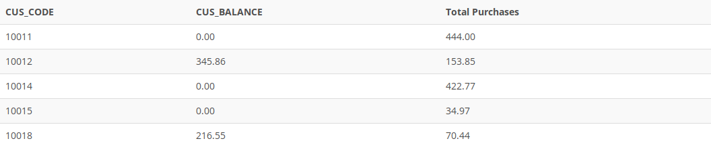

## Problem 13
Write a query to display the customer code, balance, and total purchases for each customer. Total purchase is calculated by summing the line subtotals (as calculated in *Problem 12*) for each customer. Sort the results by customer code, and use aliases as shown in *Figure P7.13*.

Figure P7.13
