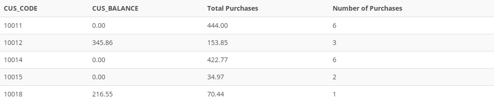

## Problem 14
Modify the query in *Problem 13* to include the number of individual product purchases made by each customer. (In other words, if the customer’s invoice is based on three products, one per `LINE_NUMBER`, you count three product purchases. Note that in the original invoice data, customer 10011 generated three invoices, which contained a total of six lines, each representing a product purchase.) Your output values must match those shown in* Figure P7.14*, sorted by customer code.

Figure P7.14
