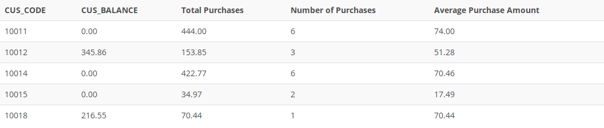

## Problem 15
Use a query to compute the total of all purchases, the number of purchases, and the average purchase amount made by each customer. Your output values must match those shown in *Figure P7.15*. Sort the results by customer code.

Figure P7.15
