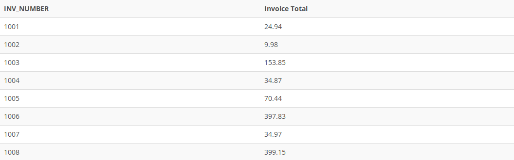

## Problem 16
Create a query to produce the total purchase per invoice, generating the results shown in *Figure P7.16*, sorted by invoice number. The invoice total is the sum of the product purchases in the `LINE` that corresponds to the `INVOICE`.

Figure P7.16
