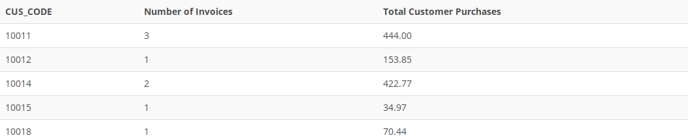

## Problem 18
Write a query to produce the number of invoices and the total purchase amounts by customer, using the output shown in *Figure P7.18* as your guide. Note the results are sorted by customer code. (Compare this summary to the results shown in *Problem 17*.)

Figure P7.18
