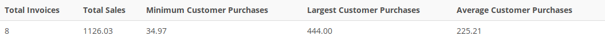

## Problem 19
Write a query to generate the total number of invoices, the invoice total for all of the invoices, the smallest of the customer purchase amounts, the largest of the customer purchase amounts, and the average of all the customer purchase amounts. Your output must match *Figure P7.19*.

Figure P7.19
