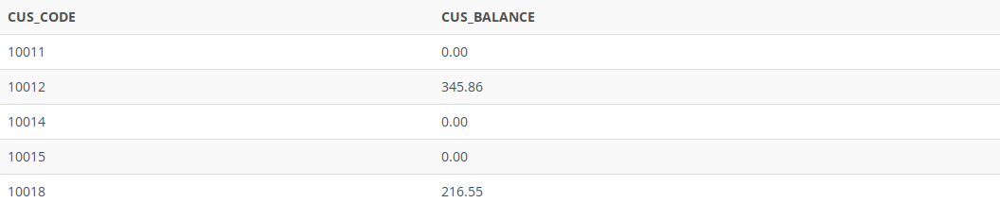

## Problem 20
List the balances of customers who have made purchases during the current invoice cycle—that is, for the customers who appear in the `INVOICE` table. Sort the results by customer code, as shown in *Figure P7.20*.

Figure P7.20
