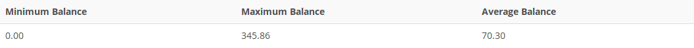

## Problem 21
Provide a summary of customer balance characteristics for customers who made purchases. Include the minimum balance, maximum balance, and average balance, as shown in *Figure P7.21*.

Figure P7.21
