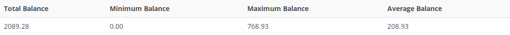

## Problem 22
Create a query to find the balance characteristics for all customers, including the total of the outstanding balances. The results of this query are shown in *Figure P7.22*.

Figure P7.22
