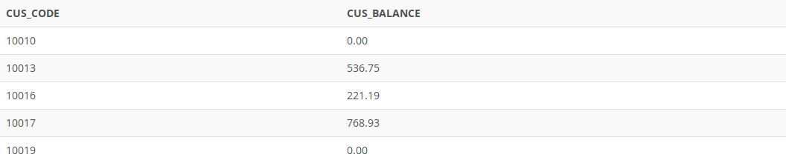

## Problem 23
Find the listing of customers who did not make purchases during the invoicing period. Sort the results by customer code. Your output must match the output shown in *Figure P7.23*.

Figure P7.23
