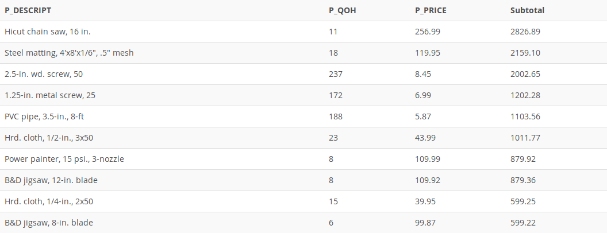

## Problem 25
Create a query that summarizes the value of products currently in inventory. Note that the value of each product is a result of multiplying the units currently in inventory by the unit price. Sort the results in descending order by subtotal, as shown in *Figure P7.25.*

Figure P7.25
