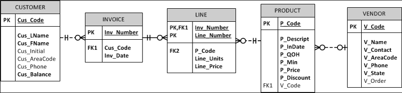
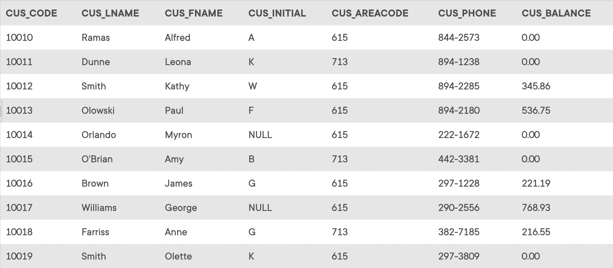
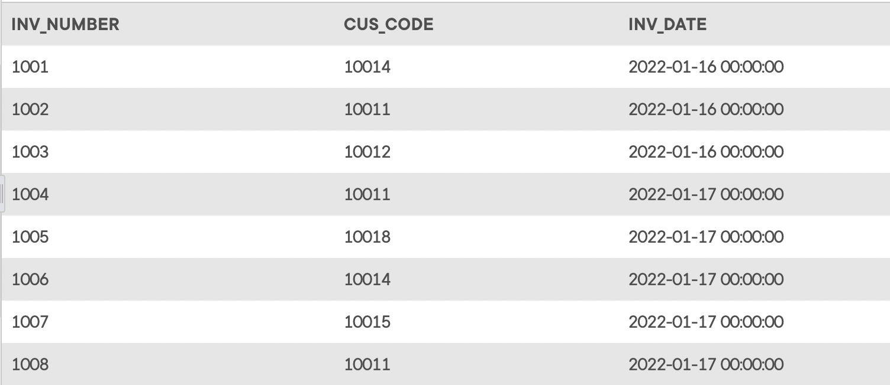
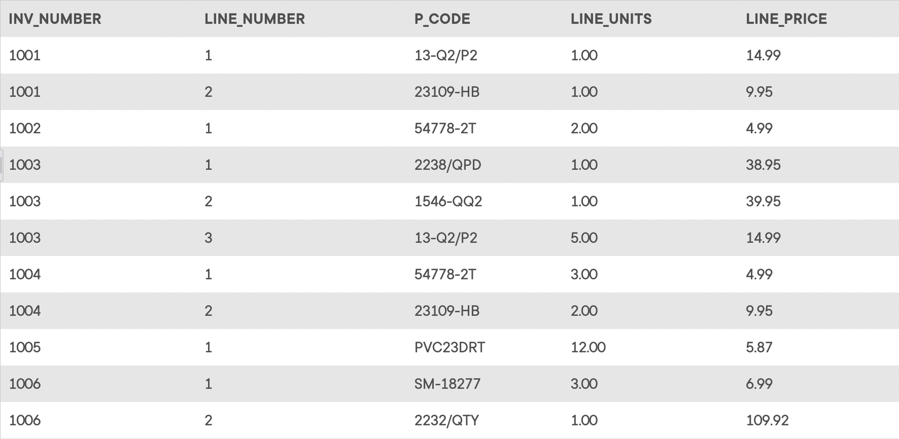
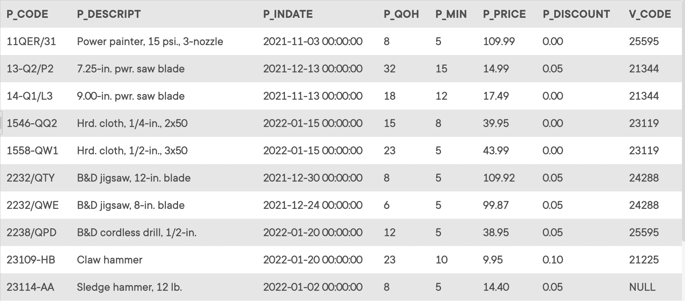
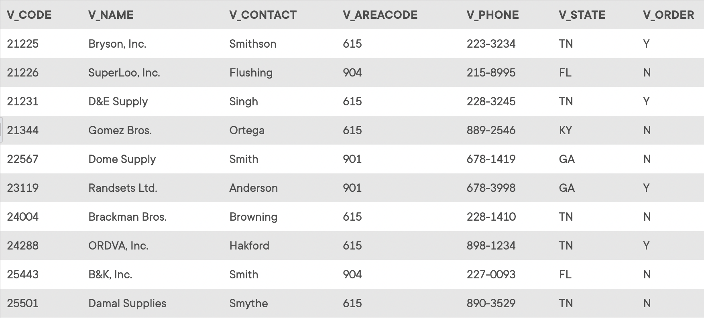

## Summary

The *Ch07_SaleCo* database stores data for a consulting company that tracks all charges to projects. The charges are based on the hours each employee works on each project. The structure and contents of the *Ch07_SaleCo* database are shown in the tables below.

## Database Schema

Click on the image to open it in a new tab for better readability.

> The images below may not include all the data in the corresponding table.

_The `CUSTOMER` table_

_The `INVOICE` table_

_The `LINE` table_

_The `PRODUCT` table_

_The `VENDOR` table_

## Instructions

Given the structure of the *Ch07_SaleCo* database shown above, use SQL commands to answer the problems in the following steps.

Write your SQL statement in the editor below each question, then click the **Run** button to execute your statement in the interactive MySQL shell.

Click **Next Step** to get started!
