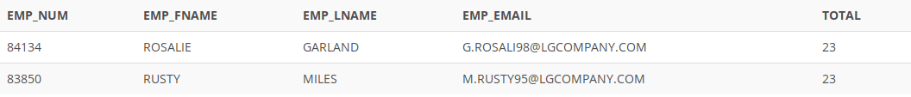

## Problem 51
The Binder Prime Company wants to recognize the employee who sold the most of its products during a specified period. Write a query to display the employee number, employee first name, employee last name, email address, and total units sold for the employee who sold the most Binder Prime brand products between November 1, 2021, and December 5, 2021. If there is a tie for most units sold, sort the output by employee last name (*Figure P7.51*).

Figure P7.51
