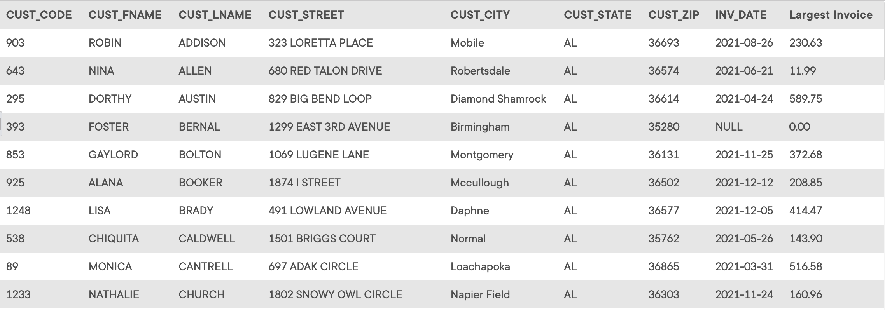

## Problem 53
LargeCo is planning a new promotion in Alabama (AL) and wants to know about the largest purchases made by customers in that state. Write a query to display the customer code, customer first name, last name, full address, invoice date, and invoice total of the largest purchase made by each customer in Alabama. Be certain to include any customers in Alabama who have never made a purchase; their invoice dates should be `NULL` and the invoice totals should display as `0`. Sort the results by customer last name and then first name (Partial result are shown in *Figure P7.53*).

Figure P7.53
