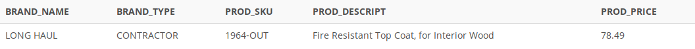

## Problem 55
The purchasing manager is still concerned about the impact of price on sales. Write a query to display the brand name, brand type, product SKU, product description, and price of any products that are not a premium brand, but that cost more than the most expensive premium brand products (*Figure P7.55*).

Figure P7.55
