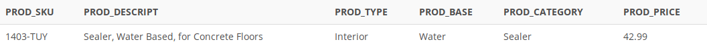

## Problem 28

Write a query to display the SKU (stock keeping unit), description, type, base, category, and price for all products that have a `PROD_BASE` of Water and a `PROD_CATEGORY` of Sealer (*Figure P7.28*).

Figure P7.28
