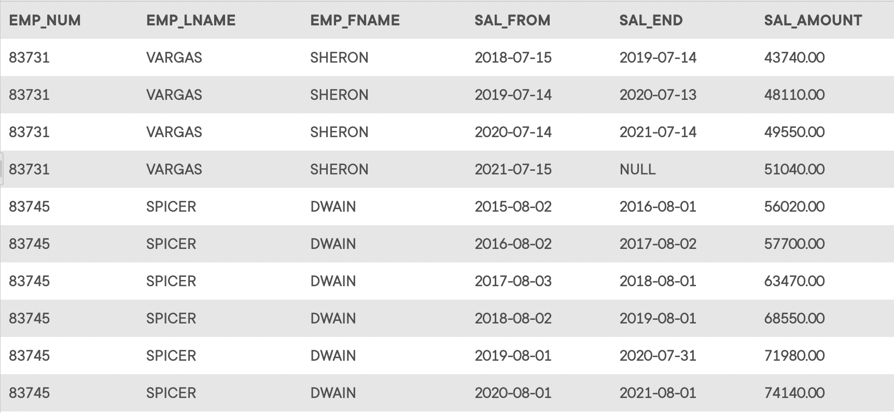

## Problem 31
Write a query to display the employee number, last name, first name, salary “from” date, salary end date, and salary amount for employees 83731, 83745, and 84039. Sort the output by employee number and salary “from” date (*Figure P7.31*).

Figure P7.31
