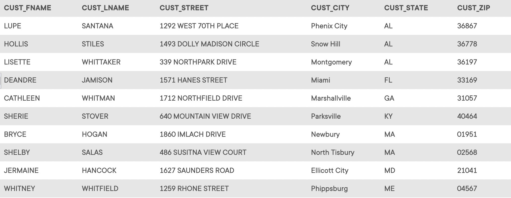

## Problem 32
Write a query to display the first name, last name, street, city, state, and zip code of any customer who purchased a Foresters Best brand top coat between July 15, 2021, and July 31, 2021. If a customer purchased more than one such product, display the customer’s information only once in the output. Sort the output by state, last name, and then first name (*Figure P7.32*).

Figure P7.32
