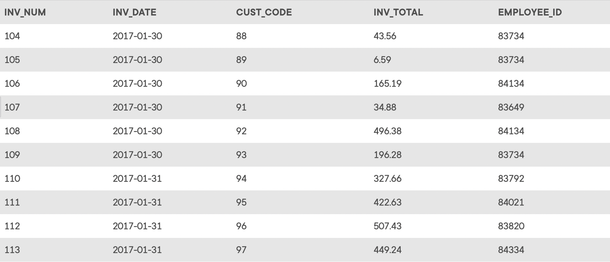

## Summary

The structure and contents of the *Ch07_LargeCo* database are shown in *Figure P7.27*. Use
this database to answer the following problems.

## Database Schema

The schema for the *Ch07_LargeCo* database is shown below. Click this image to view it in its own tab.

Click on the image to open it in a new tab for better readability.

> The images below may not include all the data in the corresponding table.

_The `LGBRAND` table_

_The `LGCUSTOMER` table_

_The `LGDEPARTMENT` table_

_The `LGEMPLOYEE` table_

_The `LGINVOICE` table_

_The `LGLINE` table_

_The `LGPRODUCT` table_

*The `LGSALARY*HISTORY` table\*

_The `LGSUPPLIES` table_

_The `LGVENDOR` table_

The _Ch07_LargeCo_ database stores data for a company that sells paint products. The company tracks the sale of products to customers. The database keeps data on customers (`LGCUSTOMER`), sales (`LGINVOICE`), products (`LGPRODUCT`), which products are on which invoices (`LGLINE`), employees (`LGEMPLOYEE`), the salary history of each employee (`LGSALARY_HISTORY`), departments (`LGDEPARTMENT`), product brands (`LGBRAND`), vendors (`LGVENDOR`), and which vendors supply each product (`LGSUPPLIES`). Some of the tables contain only a few rows of data, while other tables are quite large; for example, there are only eight departments, but more than 3,300 invoices containing over 11,000 invoice lines. For _Problems 28–55_, a figure of the correct output for each problem is provided. If the output of the query is very large, only the first several rows of the output are shown.

## Instructions

Given the structure of the *Ch07_LargeCo* database shown above, use SQL commands to answer the problems in the following steps.

Write your SQL statement in the editor on the right, then click the **Run** button to execute your statement in the interactive MySQL shell.

Click **Next Step** to get started!
