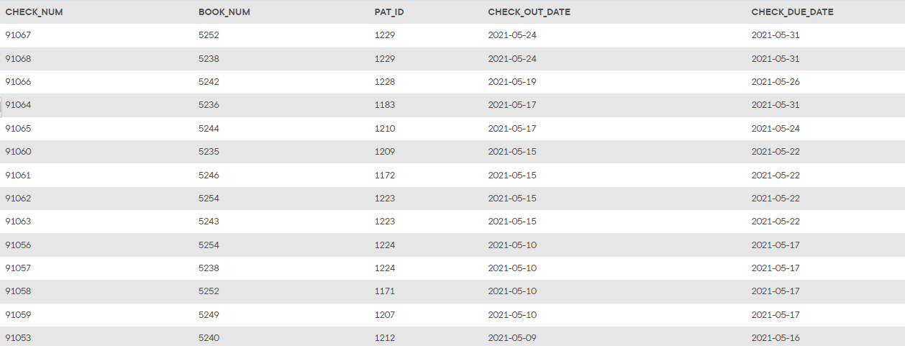

## Problem 63
Write a query to display the checkout number, book number, patron ID, checkout date, and due date for every checkout that has ever occurred in the system. Sort the results by checkout date in descending order and then by checkout number in ascending order (Partial results are shown in *Figure P7.63*).

Figure 7.63
