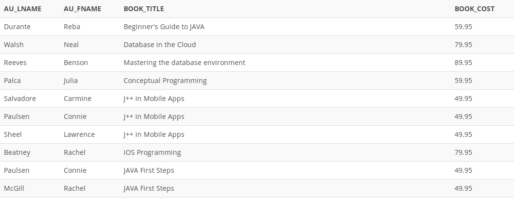

## Problem 92
Write a query to display the author last name, first name, book title, and replacement cost for each book. Sort the results by book number and then author ID (*Figure P7.92*). (25 rows)

Figure 7.92
