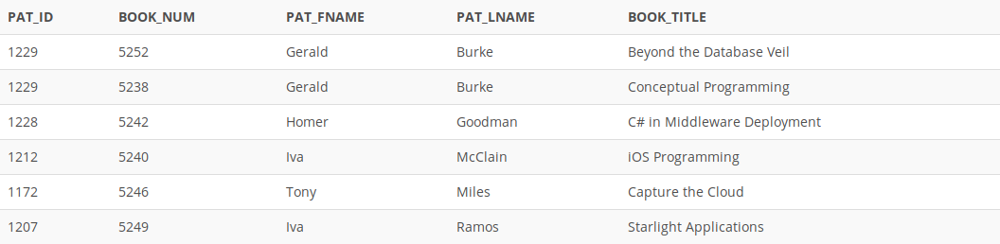

## Problem 93
Write a query to display the patron ID, book number, patron first name and last name, and book title for all currently checked out books. (Remember to use the redundant relationship described in the assignment instructions for current checkouts.) Sort the output by patron last name and book title (*Figure P7.93*).

Figure 7.93
