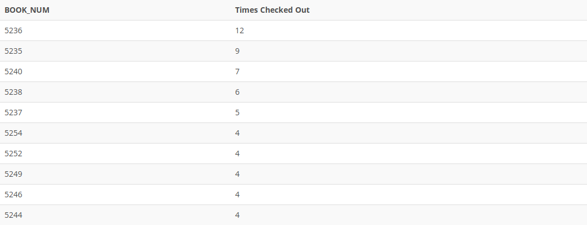

## Problem 95
Write a query to display the book number and the number of times each book has been checked out. Do not include books that have never been checked out. Sort the results by the number of times checked out in descending order and then by book number in descending order (*Figure P7.95*).

Figure 7.95
