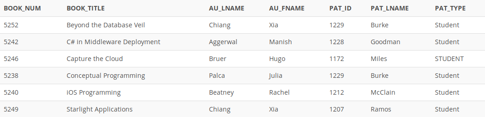

## Problem 97
Write a query to display the book number, title, author last name, author first name, patron ID, last name, and patron type for all books currently checked out to a patron. Sort the results by book title (*Figure P7.97*).

Figure 7.97
