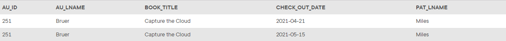

## Problem 100
Write a query to display the author ID, author last name, book title, checkout date, and patron last name for all the books written by authors with the last name “Bruer” that have ever been checked out by patrons with the last name “Miles.” Sort the results by check out date (*Figure P7.100*).

Figure 7.100
