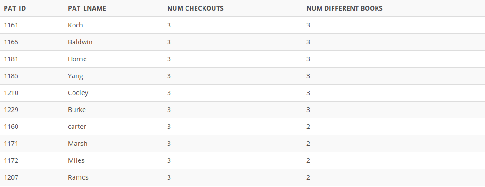

## Problem 102
Write a query to display the patron ID, last name, number of times that patron has ever checked out a book, and the number of different books the patron has ever checked out. For example, if a given patron has checked out the same book twice, that would count as two checkouts but only one book. Limit the results to only patrons who have made at least three checkouts. Sort the results in descending order by number of books, then in descending order by number of checkouts, and then in ascending order by patron ID (*Figure P7.102*).

Figure 7.102
