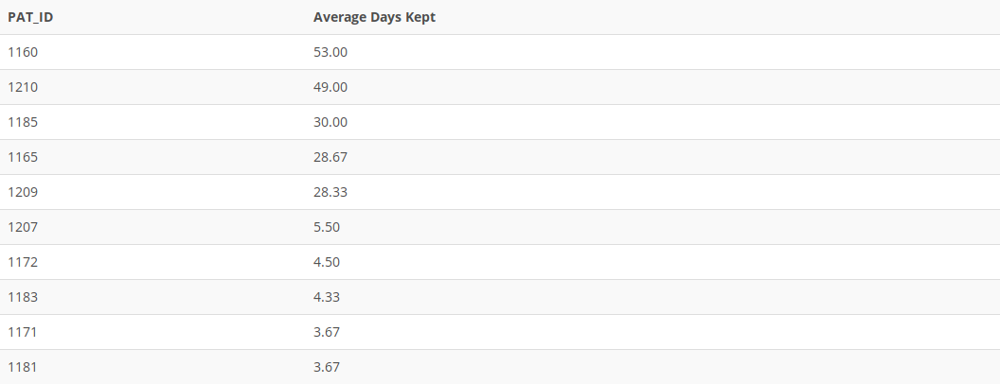

## Problem 104
Write a query to display the patron ID and the average number of days that patron keeps books during a checkout. Limit the results to only patrons who have at least three checkouts. Sort the results in descending order by the average days the book is kept, and then in ascending order by patron ID (*Figure P7.104*).

Figure 7.104
