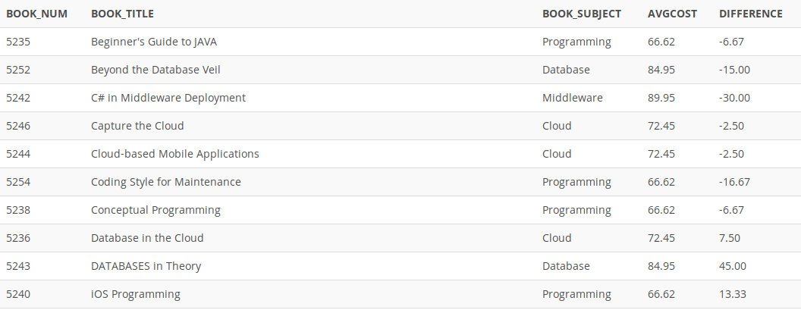

## Problem 107
Write a query to display the book number, title, subject, average cost of books within that subject (AVGCOST), and the difference between each book’s cost and the average cost of books in that subject. Sort the results by book title (*Figure P7.107*).

Figure 7.107
