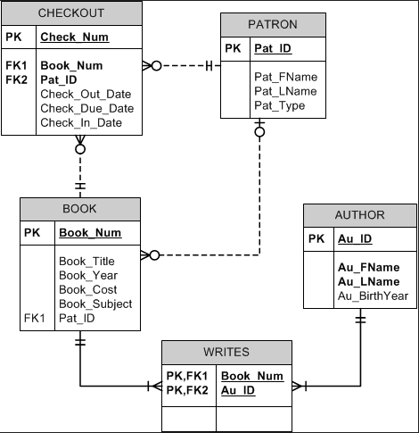
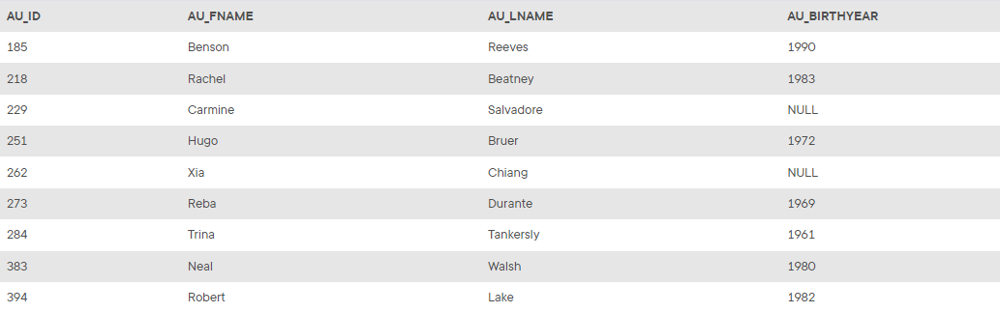
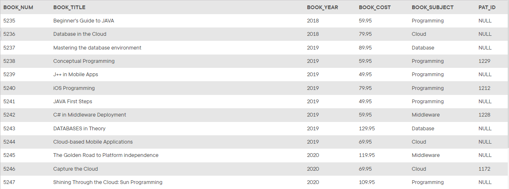
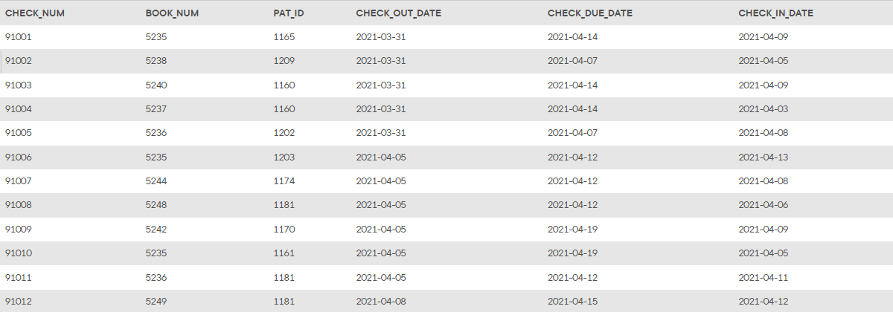
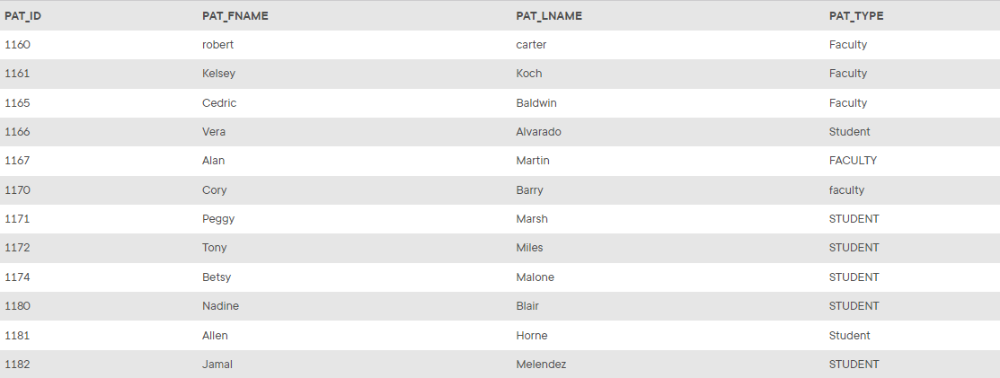
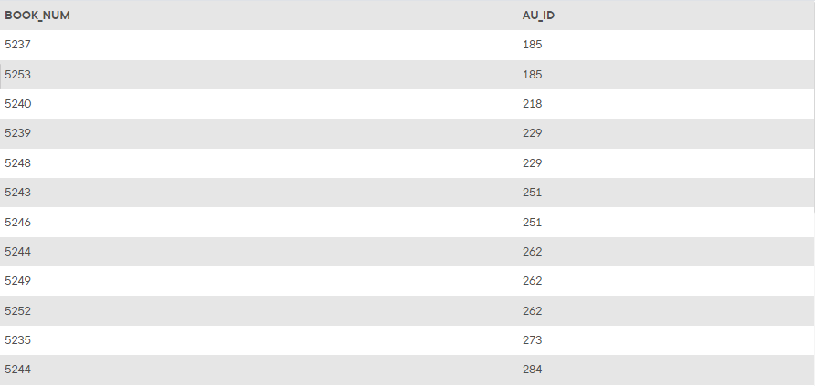

## Summary

The structure and contents of the *Ch07_FACT* database are shown below. Use this database to answer the following problems.

## Database Schema

The schema for the *Ch07_FACT* database is shown below and should be used to answer the next several problems. Click this image to view it in its own tab.

Click on the image to open it in a new tab for better readability.

> The images below may not include all the data in the corresponding table.

_The `AUTHOR` table_

_The `BOOK` table_

_The `CHECKOUT` table_

_The `PATRON` table_

_The `WRITES` table_

The CIS Department at Tiny College maintains the Free Access to Current Technology (FACT) library of e-books. FACT is a collection of current technology e-books for use by faculty and students. Agreements with the publishers allow patrons to electronically check out a book, which gives them exclusive access to the book online through the FACT website, but only one patron at a time can have access to a book. A book must have at least one author but can have many. An author must have written at least one book to be included in the system but may have written many. A book may have never been checked out but can be checked out many times by the same patron or different patrons over time. Because all faculty and staff in the department are given accounts at the online library, a patron may have never checked out a book or they may have checked out many books over time. To simplify determining which patron currently has a given book checked out, a redundant relationship between `BOOK` and `PATRON` is maintained.

For *Problems 57–109*, a figure of the correct output is provided for each problem. If the output of the query is very large, only the first several rows of the output are shown.

## Instructions

Given the structure of the *Ch07_FACT* database shown above, use SQL commands to answer the problems in the following steps.

Write your SQL statement in the editor on the right, then click the **Run** button to execute your statement in the interactive MySQL shell.

Click **Next Step** to get started!
