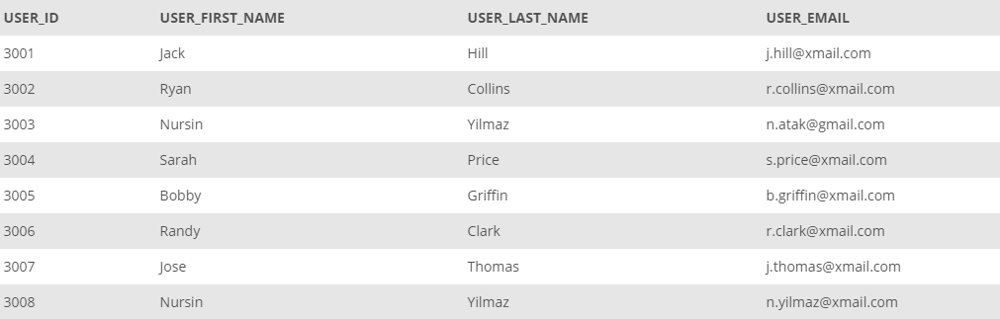
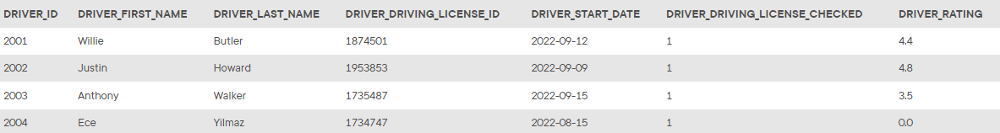
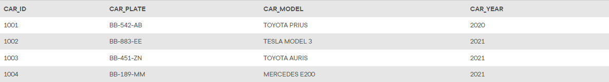
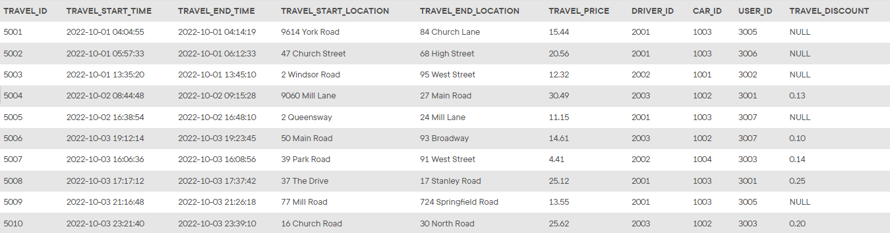

## Scenario and Database Model: InstantRide

**InstantRide** is the new ride sharing application in the city and it has just started its operations. With the help of the InstantRide mobile application, the users request a ride with their location. Drivers and cars are assigned to the request; and then the driver picks up the user to ride their requested location. Information for the users, drivers and cars are stored in the database as well as the travel transactions.

In the `USERS` table, information for the users are stored with their first name, last name and email:

*USERS Table*

In the `DRIVERS` table, all the drivers in the InstantRide are stored with their name, driving license number and check and rating information:

*DRIVERS Table*

In the `CARS` table, all the cars in the InstantRide system are kept with the license plate, model and year:

*CARS Table*

Finally, the transactions of the rides are stored in the `TRAVELS` table. For each travel, start and end time with location are stored. In addition, the involved driver, car and user are listed for each drive. Price and discount information are also available in the database:

*TRAVELS Table*

You are assigned as the database administrator to collect and manage transactional data of the InstantRide operations. Your main task is to create SQL scripts to help other teams to retrieve the requested data. In the following activities, you will create the scripts, run against the database and send the result to the corresponding teams.
