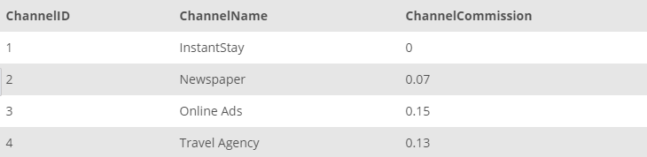

## Task 1:

The InstantStay Channel Development team works together with channels in the platform to increase their potential and number of reservations. The Channel development team requires all data available about the channels for their new dashboard team. Run the following query to get the all channel information:

```mysql
SELECT
    *
FROM
    CHANNEL;
```

The results you send to the Channel Development team should look like the example shown below:

<p align='center'>

</p>

<sup>_All channel information_</sup>
