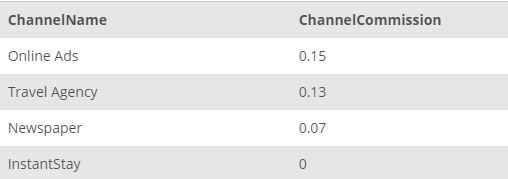

## Task 2:

In addition, Channel Development team requires the following information for their weekly-channel presentation:

- list of all channel names,
- channel names ordered by commission in starting with the highest commission rate
- channel names which have commission rates higher than 10%

Run the following queries and send the collected information:

```mysql
SELECT
    ChannelName
FROM
    CHANNEL;
```

```mysql
SELECT
    ChannelName, ChannelCommission
FROM
    CHANNEL
ORDER BY ChannelCommission DESC;
```

```mysql
SELECT
    ChannelName, ChannelCommission
FROM
    CHANNEL
WHERE
    ChannelCommission > 0.1;
```

The results you send to the Channel Development team should look like the example shown below:

<p align='center'>

</p>

<p align='center'>

</p>

<p align='center'>

</p>

<sup>_Detailed channel information_</sup>
