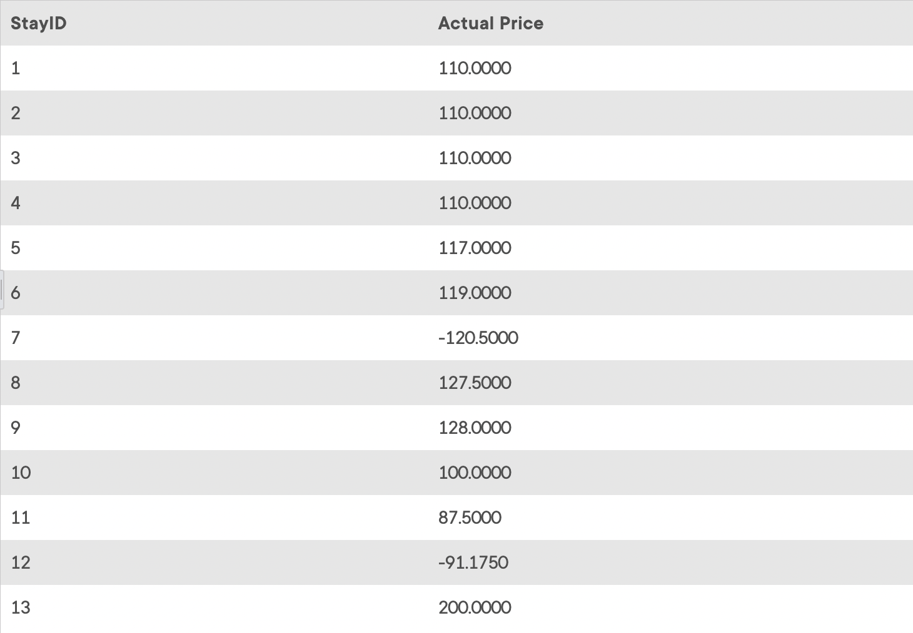

## Task 3:

The InstantStay Finance team requires the actual prices for the stays in the system. Calculate the actual price using the price and discount amount from the corresponding tables. Run the following query to get the actual price data:

```mysql
SELECT
    StayID, StayPrice * (1 - StayDiscount) AS 'Actual Price'
FROM
    STAY;
```

This statement returns the computed actual price:
<p align='center'>

</p>

<sup>_Actual price data_</sup>
