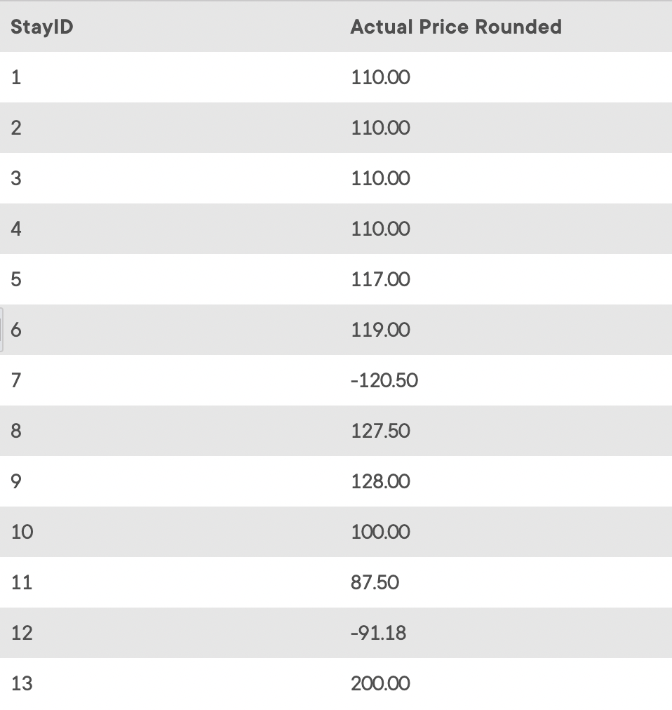

## Task 4:

The InstantStay Finance team indicates that the retrieved data is not suitable for making payments as currency. You need to round up the actual prices to have only **2** decimals:

```mysql
SELECT
    StayID,
    ROUND(StayPrice * (1 - StayDiscount), 2) AS 'Actual Price Rounded'
FROM
    STAY;
```

The above query calculates prices in compliance to the currency:

<p align='center'>

</p>

<sup>_Rounded actual price data_</sup>
