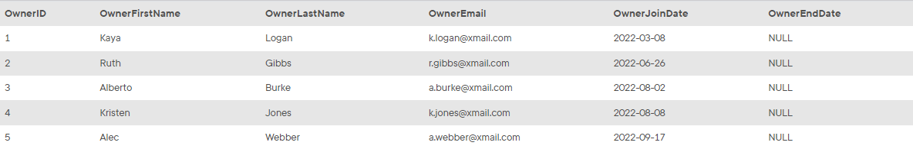

## Task 5:

The InstantStay Owner Relationships team wants to send thank you notes to the owners joined in the last year and still in the InstantStay system. Collect all owners joined in the last year and did not leave the system yet:

```mysql
SELECT
    *
FROM
    OWNER
WHERE
    (OwnerJoinDate >= DATE_ADD(CURDATE(), INTERVAL - 1 YEAR))
        AND OwnerEndDate IS NULL;
```

You will get the detailed information about the owners:

<p align='center'>

</p>

<sup>_Owners joined in the last year_</sup>
